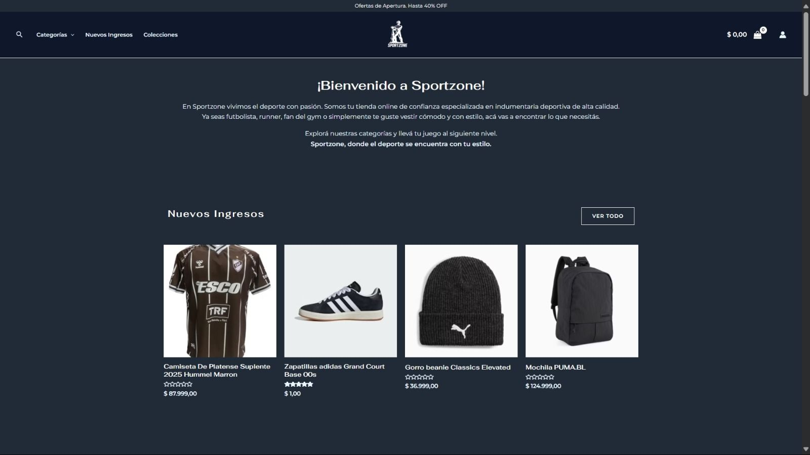
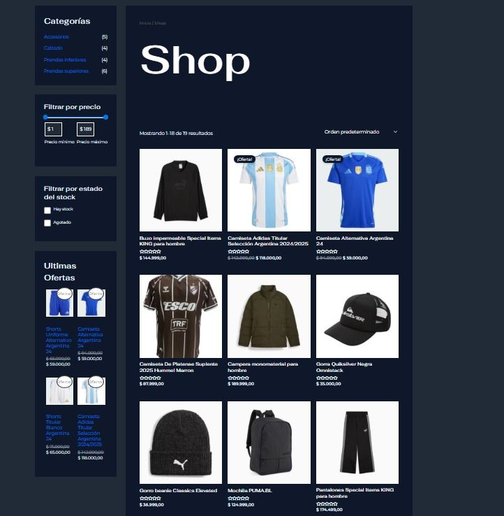
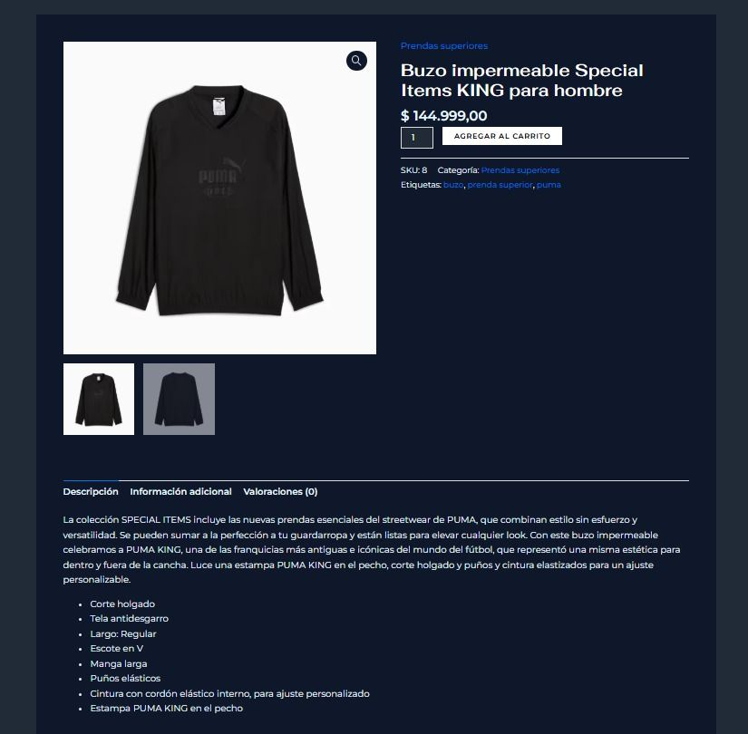

# ⚡ SportZone – WordPress Website 🚀
**Systems Engineering Academic Project - UNPA**

**SportZone** is a modern and responsive platform, designed under engineering standards to provide efficient content management. The project focuses on information architecture and software metrics.

> [!NOTE]
> This project was temporarily deployed for academic defense. Currently, access is available through the technical documentation and attached screenshots.

---

## 🎯 Project Objectives
The development focused on applying engineering methodologies to create a scalable digital product:

* **⚡ Performance:** Asset optimization and response time improvements.
* **📱 UX/UI:** Responsive design and intuitive navigation based on information architecture.
* **🔍 SEO:** Structure prepared for search engine visibility.

---

## ⚙️ Tech Stack

| Component | Technical Detail |
| :--- | :--- |
| **CMS** | WordPress 6.x |
| **Database Engine** | MySQL 8.0 |
| **Runtime Environment** | PHP 8.2 |
| **Layout & Design** | Elementor & Native Blocks |
| **Hosting** | Hostinger Premium |

---

## 🚀 Key Features
- 🛠️ **Deep Customization:** Astra framework adaptation through custom CSS.
- 📦 **Dynamic Catalog:** Automated management of sports products and services.
- 📊 **Technical Analysis:** Effort estimation using **FPA** (Function Point Analysis) and **COCOMO**.
- ✅ **Core Web Vitals:** Focus on loading metrics and visual stability.

---

## 📸 Project Gallery

| Home Page | Products Section | Detailed View |
| :--- | :--- | :--- |
|  |  |  |

---

## 📚 Technical Documentation
The complete project lifecycle documentation is centralized here for academic transparency:

* [📄 **SRS**](docs/Especificación%20de%20Requerimientos%20de%20Software%20-%20SportZone.pdf) - Software Requirements Specification.
* [📄 **Development Plan**](docs/SportZone_Plan_de_Desarrollo_v1.0.pdf) - Planning and engineering metrics.
* [📄 **Risk Matrix**](docs/Lista%20de%20Riesgos%20-%20SportZone.pdf) - Contingency analysis and mitigation.

---

## 👤 Contact & Profile
**Elías Uriel González** *Systems Engineering Student | UNPA Caleta Olivia*

---
Academic project developed by Elías Uriel González. Licensed under GPL v2.
